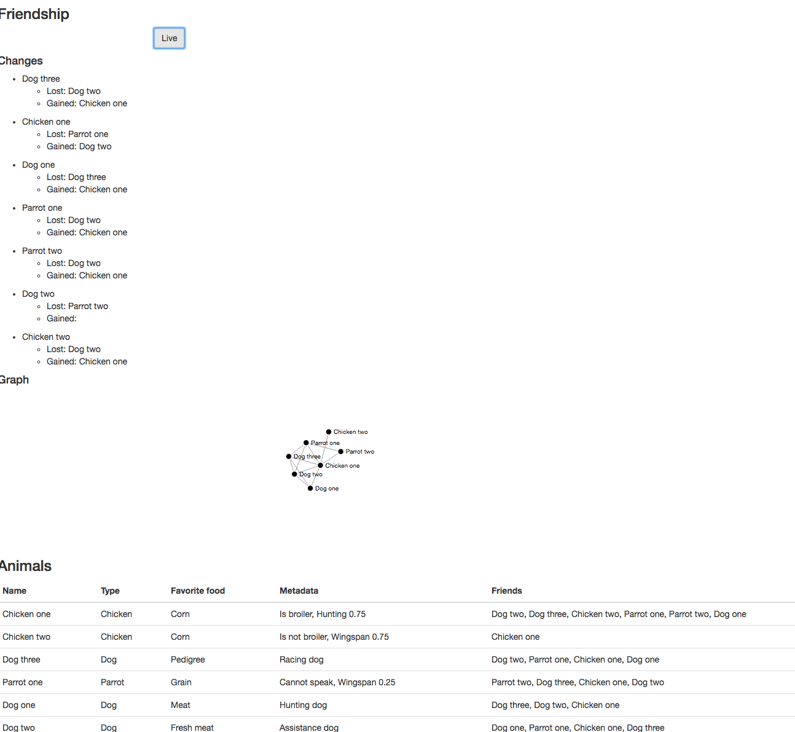

# lion-friends 

## Test coverage on develop branch
Backend 

Frontend 

## How to build
There are two build processes: one for the frontend and one for the backend. As all the resources are packaged in the jar (html and javascript), you should rund the frontend build before the backend one.
You can also optionally build a docker image.

Both the frontend and backend are also build on TravisCI (see .travis.yml) and have test coverage reports, see this readme.

### Requirements
Node, maven should be installed. Chrome is optional but is used in the unit tests. The application is also only tested on chrome, but any evergreen browser should do.

### Frontend
The frontend is javascript based and the build system is plain npm. There are 3 scripts for the build: install, lint(optional) and test_chrome(optional). To run the scripts us npm run &lt;script&gt;.

install: Will install all dependencies. It also installs a local copy of bower and then installs all the bower dependencies. This is all that is needed to build the frontend. See package.json and bower.json.

lint: Uses eslint to lint the code and check the codestyle. It uses both the recommended rules and angular specific rules. See the .eslintrc file.

test_chrome: Runs the unit tests of the frontend with help of karma. See the karma.conf.js file.
### Backend
The build system is based on maven. This both builds and tests the code. To run maven use 'mvn clean install'.

### Docker
A docker file is provided to build the docker image use 'docker build -t lion-friends .' (mind the dot at the end). The docker file exposes one port 8080.

## How to run
The application can both be run as a java application or a docker based application.

### Java
Simply run 'java -jar target/lion-friends-0.0.1-SNAPSHOT.jar'. This will startup the embedded tomcat container. The application is serverd at localhost:8080.

### Docker
To run with docker, first build the image and then run 'docker run -p 8080:8080 lion-friends' (other port mappings are off course also valid). The applicaiton is then served on localhost:8080, unless a virutal machine is used (as on osX) then it is server on &lt;virtual ip&gt;:8080.

## Design
### General
The application is a rest backend with a javascript frontend. This makes it easier to seperate logic from display.

Git-flow was also used during development, to make it easy to have smaller feature branches that don't impact the develop/master branch. As it was only me developing, it is not that needed. But I still find it a very enjoyable way to work. Small commits make for small reverts ;). No release was done, so the master branch is not used. Semver would be applied if a release would be done.

As I think that testing is very important, I am an advocate for TDD and BDD. I hope this is visible in the project and the test coverage.

The following design principles were kept in mind:

* Clean code: The most important of all, and a book that every programmer should read. For me it is the most important that code is clean and understandable. That is why name giving is very important.
* TDD and BDD: Both the frontend and backend are unit tested. As this is an assignment no integration tests were written. For an example on these i point to my other repositories here on github. I also try to have documentation for the system by writting tests. This is why clear test names that convey meaning are important
* Programming to an interface: I like programming to an interface. This makes it easy to swap out implementations when it is needed, without impacting the code too much. It also makes it possible to hide some functionality across layers. This was not applied to the frontend as Angular isn't suited for this. See the backend explenation for more information.
* Separation of concern: I like to have many small beans/services/.... This makes testing easier and it also makes the code more readable.
* Composition over inheritance: I prefer inheritance over composition. This is applied on the backend, see explanation for more information.
* Stateless: I prefer to have as little state as possible in my systems. This makes it much easier to reason about the system and limits side effects. Only the repositories hold state in this application.
* Open source: I prefer to use established open source components over writing anything myself. Afterall if a lot of people have worked on it and a lot of people use it, it must be better then something I can write and there will be a lot of documentation about it. And if something doesn't work, you can always look in the code and make a pull request.

### Backend
The backend is build with the help of Spring boot. This is a handy framework to quickly get a small server running. It boots up an embedded container (Tomcat in this case), so there is no need for an app server either.

The backend is build around 2 layers: domain and rest. As no cross cutting concerns are specified (transactionality, security), no service layer is used.
Only the rest layer may use the domain layer and not the other way around. To make sure the rest layer can only use certain functionality of the domain layer, interfaces are used. These interfaces provide an API for the other layer to use. So the rest layer should only use interfaces from the domain layer. Also between components on the same layer, interfaces should be used. This leads to both horizontally and vertically seperated code. eg the friendship slice can only use interfaces from the animal slice, not the implementations itself.

#### Domain model
As I prefer composition over inheritance I didn't build a hierarchical structure of animals and dogs, chickens, .... The fact that there was no functionality/state to be overriden between to different animals also influenced this decision.
The main entities are:
* animal: Represents an animal with its attributes: name, type, favorite food, metadata. As the metadata isn't used for functionality and only for display, I modelled it as a simple set.
* friendship: Represents the friendship between two animals. Also has an established day, so that a friendship lasts minimally one day
* friendshipChange: Represents the change in friendship for one animal on one day. Has the day, lost friend and gained friend as attributes. These get constructed during the 'live' functionality so the change in friendship can be displayed.

### Frontend
The frontend is written in AngularJS as this is the frontend tech I am most familiar with and I also really like it as it leads to clean code. The layout is rather crude, as I am not a designer.

The frontend also has layer:
* Components: These represent a piece of ui and are modelled as a tag. This helps to seperate the template from the logic code. It is also adviced by the angular team and W3C.
* Controllers: These connect the ui to the data. These are as light as possible and only contains code to format certain things an as a connection between the html and the data.
* Repositories: Modelled as Angular services. These manage the data and communicate with the backend.

The code is also promised based.

I added a graph as I think this is a clear way to represent the data. I also think it just looks cool and I never displayed a graph in javascript before ;).

